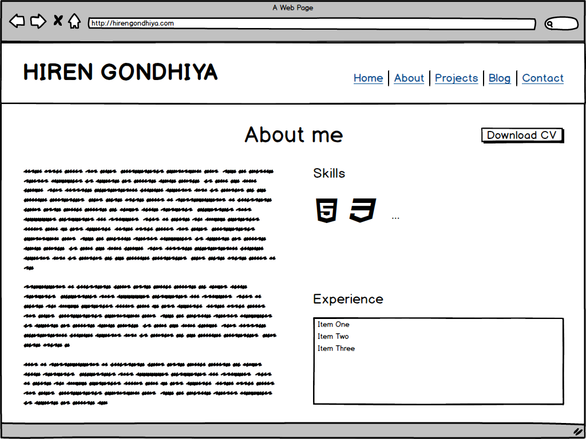

# Hiren Gondhiya - Portfolio Website
## Links
- Website: https://hirengondhiya.github.io/
- Source code Repository: https://github.com/hirengondhiya/hirengondhiya.github.io

## Description
- ### Purpose
    The purpose of my portfolio website is to practice and to show my professional web development, Project Planning, & execution skills to the world using a simple and clean website. 
    
    Through this website I am also hoping to get in contact with perspective employers for employment opportunities and with like minded developers for collaboration on open source projects.

- ### Wireframes
    
    Before getting started with developing the web site wireframes were built to plan different kind of pages that I need to build to serve above purpose and to visulise how they should look like on small screen and large screen devices.

    I have come with following wireframes.

    1. Home Page

        - Small Screen

            

        - Small Screen Menu

            

        - Large Screen

            

    2. About Page

        - Small Screen

            

        - Large Screen

            

    3. Projects Page

        - Small Screen

            

        - Large Screen

            

    4. Blogs Page

        - Small Screen

            

        - Large Screen

            

    5. Contact Page

        - Small Screen
        
            

        - Large Screen
        
            

- ### Features

    Keeping simplines and cleanliness as main goal following features were implemented on the website to engage the users and feed important content.

    1. **Responsive Expandable Menu**
        
        The menu on the website is responsive to allow small screen and large screen users to efficiently navigate around the pages.

        To make optimal use of the screen space menu is initially collapsed and can be expanded by clicking/touching bars icon which then changes to **X** to give a clue to the user that the menu can be collapsed by clicking/touching it.

        For consistency the menu functions similarly on small screen and large screen device.

        The grey background on the menu item indicates the page that is being browsed by the user.
    2. **Social Media Icons List**

        The main purpose of this component is to advertise about the social media applications that I currently use and that way allow the users to follow/contact me on social media.

        The component uses svg icons belonging to each social media that I am using. 

        This feature is reausable it is used on Home Page below profile image and on Contact page.
    3. **Favicon**

        Favicon is a small icon that shows up on the tab next to site title. I have used my profile image as favicon since the website is mainly conveying my personal brand.

        By applying favicon it is very easy to identify my website when there are multiple tabs belonging to different websites are open in a single browser window.

    4. **Greeting on Home Page**

        The greeting component is used on home page to welcome the user as well as give a brief idea of what this site is all about.

        The component is made up of two parts a heading and a greeting text.

    5. **Two Dimentional Skills List**

        The two dimentional skills list was developed to communicate different category and the specific skills under each category.

        The component uses table like layout where each category heading and the skills for the category acts as a single column of the table.

    6. **Large Download CV Button**

        Download CV button is used to give a link to my pdf format CV. The link is styled to look like a big button so that it gets users attention.

    7. **Alternating Image and Text based grid (on Projects and Blogs pages)**

        Alternating Image and Text component is used to give an interesting look to the the page by using two column **CSS Grid** layout and by alternate placing of images and text in columns.

    8. **News Page type text wrapping around main image**

        The blog page that can be accessed by clicking/touching blog title from listing page, implements test wrap around feature to give the blog a layout similar to used by News Articles.

        The feature is implemented by using float property of css.

    9. **Responsive Design**

        All the pages on the web site are responsive to make sure the content is readable both on small screen and large screen devices.

        Media queries are used for implementing the responsive design features.

- ### Sitemap

    

    As indicated in image above the site has a home page which is rendered by index.html and four sub pages About.html, Projectcs.html, Blogs.html, and Contact.html. All of the above pages can be accessed through the menu.

    The Blog.html is the blog page which can be accessed from Blogs.html by clicking on title of blog listing.

- ### Screenshots
    - Mobile

        1. Home Page
            
        2. Menu Expanded
            
        3. About
            
        4. Projects
            
        5. Blogs
            
        6. Blog
            
        7. Contact
            

    - Desktop

        1. Home Page
            
        2. Menu Expanded
            
        3. About
            
        4. Projects
            
        5. Blogs
            
        6. Blog
            
        7. Contact
            

- ### Target Audience
- ### Tech stack