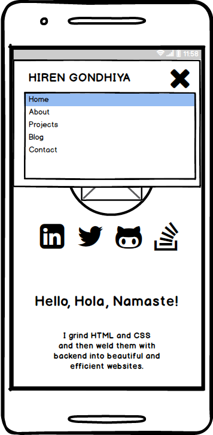
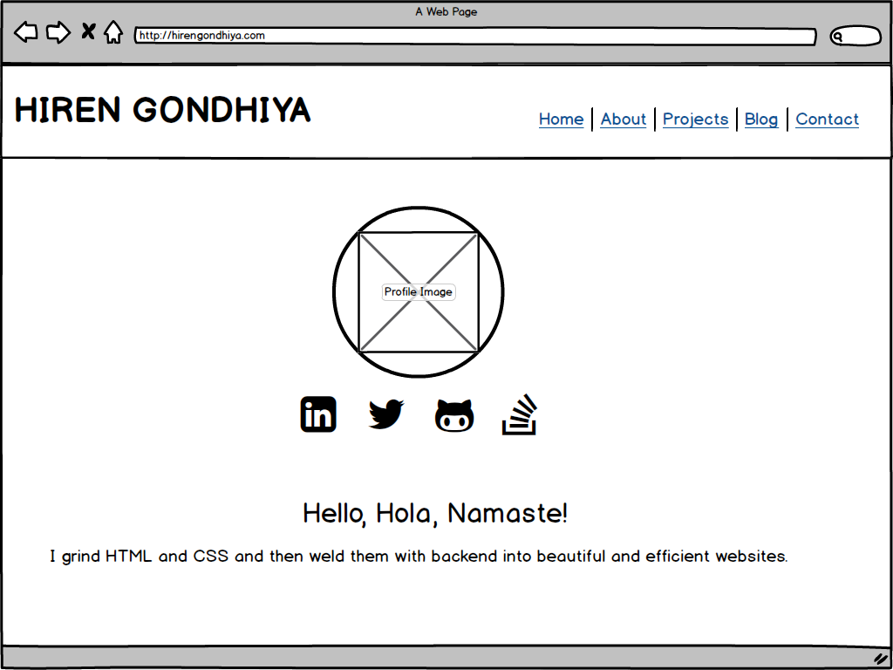

# Hiren Gondhiya - Portfolio Website
## Links
- Website: https://hirengondhiya.github.io/
- Source code Repository: https://github.com/hirengondhiya/hirengondhiya.github.io

## Description
- ### Purpose
    The purpose of my portfolio website is to practice and to show my professional web development, Project Planning, & execution skills to the world using a simple and clean website. 
    
    Through this website I am also hoping to get in contact with perspective employers for employment opportunities and with like minded developers for collaboration on open source projects.

- ### Wireframes
    
    Before getting started with developing the web site wireframes were built to plan different kind of pages that I need to build to serve above purpose and to visulise how they should look like on small screen and large screen devices.

    I have come with following wireframes.

    1. Home Page

        - Small Screen

            

        - Small Screen Menu

            

        - Large Screen

            

    2. About Page

        - Small Screen

            

        - Large Screen

            

    3. Projects Page

        - Small Screen

            

        - Large Screen

            

    4. Blogs Page

        - Small Screen

            

        - Large Screen

            

    5. Contact Page

        - Small Screen
        
            

        - Large Screen
        
            

- ### Features
- ### Sitemap
- ### Screenshots
    - Mobile
    - Desktop
- ### Target Audience
- ### Tech stack